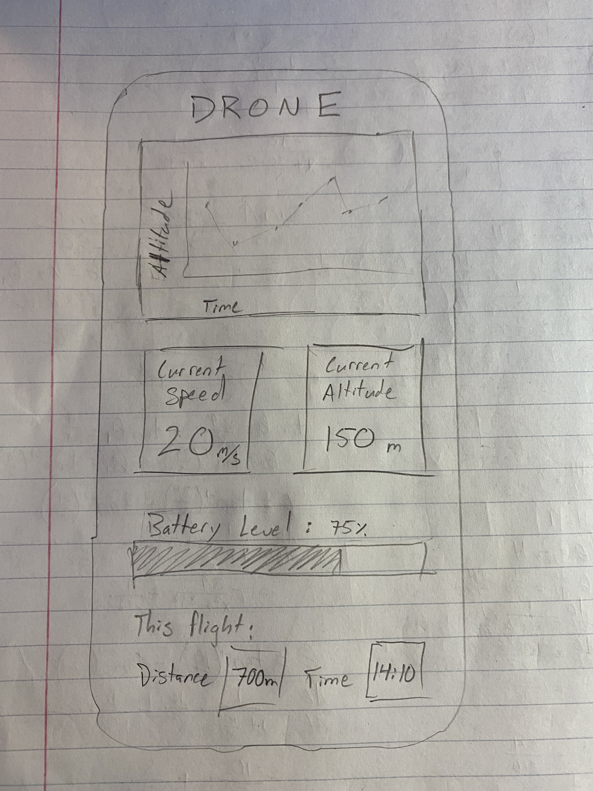

# F L Y G U Y 

---

This is an app which displays data from a drone. It only has one page, as shown in the sketch below. The name of the app is displayed at the top of the screen, with a chart centered at the top. This chart will display altitude data over time. There will then be two fields in the middle displaying current speed and current altitude, and a bar with the battery level of the drone. There will be data at the bottom of the display showing details about the flight such as distance traveled and total time. 

---

Skectch of app: 

  

